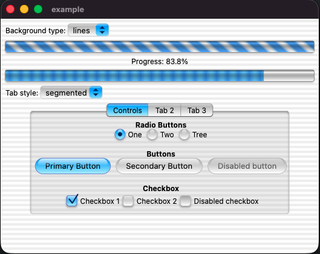
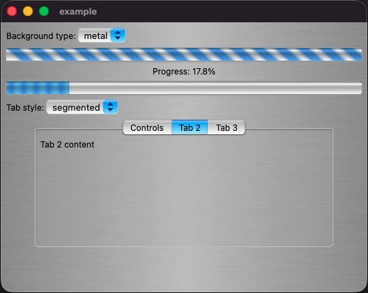

# Aqua UI
 
 

A Flutter package that revives the iconic Aqua style of Mac OS X, allowing you to create interfaces with the classic, glossy, and translucent aesthetic of the original macOS — directly in your cross-platform applications. inspired on [flutter95](https://pub.dev/packages/flutter95) and [xp_ui](https://pub.dev/packages/xp_ui)

## Screenshots

### Contributing

You can contribute in different ways:

- Creating new WindowsXp styled components.
  - Please include screenshots in your PRs!
  - Please update the example and tests to include the new component!
- Improving existing components with better options.
- Improving documentation both in code and this README file.
- Fixing lint issues.
- Creating feature requests.
  - Please include a screenshot.
  - Also don't expect a quick response, this is a hobby project.
- Reporting bugs. 